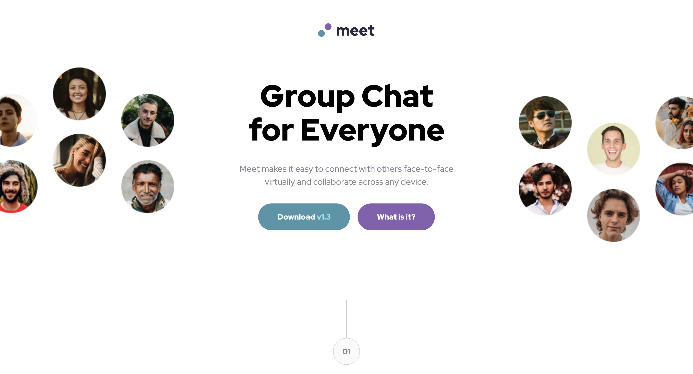

# Frontend Mentor - Meet landing page solution

This is a solution to the [Meet landing page challenge on Frontend Mentor](https://www.frontendmentor.io/challenges/meet-landing-page-rbTDS6OUR). Frontend Mentor challenges help you improve your coding skills by building realistic projects.

## Table of contents

-   [Overview](#overview)
    -   [The challenge](#the-challenge)
    -   [Screenshot](#screenshot)
    -   [Links](#links)
-   [My process](#my-process)
    -   [Built with](#built-with)
    -   [What I learned](#what-i-learned)
    -   [Continued development](#continued-development)
-   [Author](#author)

## Overview

### The challenge

Users should be able to:

-   View the optimal layout depending on their device's screen size
-   See hover states for interactive elements

### Screenshot



### Links

-   Solution URL: [Solution URL](https://github.com/Joshk7/meet-landing-page)
-   Live Site URL: [Live Site URl](https://meet-landing-page-ivory-theta.vercel.app/)

## My process

Initially, I started this challenge as a React project then discovered that I didn't need to create many separate components so that might have been overkill. Once I got react setup for this project, I went ahead and styled the button component and centered numbers "01 and 02". Then I started at the top of the mobile design with the meet logo and worked my way down the entire mobile layout until everything worked there. I had to go back a couple of times to think about setting grid and flexbox layouts for different sections.

### Built with

-   Semantic HTML5 markup
-   CSS custom properties
-   Flexbox
-   CSS Grid
-   Mobile-first workflow
-   [React](https://reactjs.org/) - JS library

### What I learned

I learned a little bit more about css grid and how it portions out the size of elements based on the rest of the space in the container using fractional units (1fr) as well as how CSS grid works with elements that haven't had a hard width set on them.

The main hero container the holds the h1 header for the website uses grid-areas nicely for the final layout at large screen sizes:

```css
.hero__container {
    display: grid;
    grid-template-areas: "left text right";
}
```

The 'left' and 'right' areas are portioned out based on the remaining space that the main 'text' content takes up. I also had to use flex containers to set the left image in the top left of it's container and the right to the bottom right.

### Continued development

To continue this project, one could have the links for the buttons actually download something as well as link to other useful resources.

## Author

-   Website - [Joshua Kahlbaugh](https://joshuakahlbaugh.pages.dev/)
-   Frontend Mentor - [@Joshk7](https://www.frontendmentor.io/profile/Joshk7)
